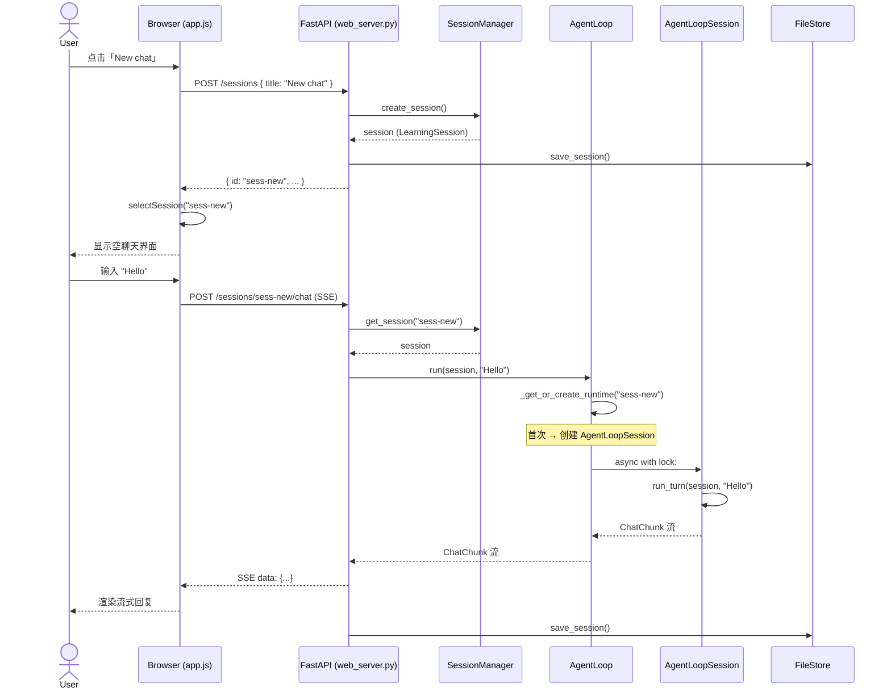

# 技术设计文档：Web 前后端适配方案

> **目标**：配合 AgentLoopSession 架构重构，确保 Web 前后端正确支持多 Session 生命周期管理
> **范围**：`learning_agent/web_server.py`、`web/` 目录（前端）
> **文档日期**：2026-05-12

---

## 一、当前 Web 架构分析

### 1.1 后端架构

```
┌─────────────────────────────────────────────┐
│  FastAPI (127.0.0.1:8000)                   │
│  ├── lifespan: 全局 LearningAgentSystem     │
│  │   └── agent_loop: AgentLoop (单例)       │
│  │   └── session_manager: SessionManager    │
│  │   └── file_store: FileStore              │
│  │   └── memory_manager: MemoryManager      │
│  │   └── event_bus: EventBus                │
│  │   └── observability: ObservabilityCollector│
│  └── REST API Endpoints                     │
│      ├── POST /sessions        (创建)       │
│      ├── GET  /sessions        (列表)       │
│      ├── GET  /sessions/{id}   (详情)       │
│      ├── POST /sessions/{id}/chat (SSE 对话)│
│      ├── POST /sessions/{id}/fork (Fork)    │
│      ├── PUT  /sessions/{id}   (重命名)     │
│      ├── DELETE /sessions/{id} (删除)       │
│      └── GET  /observability/* (观测)       │
└─────────────────────────────────────────────┘
```

**关键发现：**
1. `DELETE /sessions/{id}` 只清理了 `session_manager._sessions` 和文件系统，**没有通知 `AgentLoop` 清理运行时状态**
2. 后端没有暴露任何"当前活跃运行时"的查询接口
3. `system.agent_loop.run(session, message)` 的调用方式是正确的（传入 session 对象），内部实现变化对 API 层透明

### 1.2 前端架构

```
┌─────────────────────────────────────────────┐
│  Browser (file:// 或 http://localhost:8000) │
│  ├── index.html                             │
│  │   └── app.js (743 lines)                 │
│  │       ├── API 通信层 (fetch)              │
│  │       ├── Session 管理 (CRUD)             │
│  │       ├── Chat UI (SSE 渲染)              │
│  │       └── 状态管理 (localStorage)         │
│  └── observability.html                     │
│      └── observability.js (801 lines)       │
└─────────────────────────────────────────────┘
```

**关键发现：**
1. 前端已经完整支持 Session CRUD + 聊天，且使用 `localStorage` 缓存 `lastSessionId`
2. 前端是**单会话视图**——左侧边栏显示会话列表，主区域显示当前选中的会话消息
3. 前端没有"同时与多个会话聊天"的 UI（但 SSE 连接本身支持并发）

---

## 二、后端适配方案

### 2.1 核心原则：API 签名不变，内部行为增强

方案 A 的最大优势是：`AgentLoop.run(session, message)` 的**签名不变**。因此 Web 后端的所有 API 端点**不需要修改请求/响应格式**。

需要做的只有：**在合适的生命周期节点通知 AgentLoop 清理运行时**。

### 2.2 调整 1：删除 Session 时清理运行时（必须）

**文件**：`learning_agent/web_server.py:303-311`

**当前代码**：
```python
@app.delete("/sessions/{session_id}")
async def delete_session(session_id: str) -> dict[str, str]:
    system = _get_system()
    if session_id not in system.session_manager._sessions:
        raise HTTPException(status_code=404, detail="Session not found")
    del system.session_manager._sessions[session_id]
    system.file_store.delete(f"sessions/{session_id}.json")
    await system._save_state()
    return {"status": "deleted", "session_id": session_id}
```

**修改后**：
```python
@app.delete("/sessions/{session_id}")
async def delete_session(session_id: str) -> dict[str, str]:
    system = _get_system()
    if session_id not in system.session_manager._sessions:
        raise HTTPException(status_code=404, detail="Session not found")
    
    # 1. 清理运行时状态（新增）
    system.agent_loop.clear_session_runtime(session_id)
    
    # 2. 清理持久化数据（原有）
    del system.session_manager._sessions[session_id]
    system.file_store.delete(f"sessions/{session_id}.json")
    await system._save_state()
    
    return {"status": "deleted", "session_id": session_id}
```

**对齐 pi-mono 的 teardownCurrent() 模式**：

pi-mono 在切换 session 前调用 `teardownCurrent()` → `session.dispose()`。我们的对应物是 `clear_session_runtime()`。

| pi-mono | 我们的实现 |
|---------|-----------|
| `AgentSessionRuntime.teardownCurrent()` | `AgentLoop.clear_session_runtime()` |
| `AgentSession.dispose()` | `AgentLoopSession.clear()` |
| `ExtensionRunner.invalidate()` | （当前无扩展系统，预留接口） |

### 2.3 调整 2：系统启动/关闭时清理（推荐）

**文件**：`learning_agent/web_server.py:79-88`

**当前代码**：
```python
@asynccontextmanager
async def lifespan(app: FastAPI):
    global _system
    config = Config(config_path=os.getenv("LA_CONFIG_PATH"))
    _system = LearningAgentSystem(config)
    await _system.initialize()
    logger.info("[Web] System initialized.")
    yield
    await _system.shutdown()
    logger.info("[Web] System shutdown.")
```

**修改后**：
```python
@asynccontextmanager
async def lifespan(app: FastAPI):
    global _system
    config = Config(config_path=os.getenv("LA_CONFIG_PATH"))
    _system = LearningAgentSystem(config)
    await _system.initialize()
    
    # 启动时清理残留的运行时（新增）
    _system.agent_loop.clear_all_runtimes()
    logger.info("[Web] System initialized. All session runtimes cleared.")
    
    yield
    
    # 关闭时清理（新增）
    _system.agent_loop.clear_all_runtimes()
    await _system.shutdown()
    logger.info("[Web] System shutdown.")
```

**原因**：防止服务器重启后，旧的 `_session_runtimes` 字典中有残留（虽然 Python 进程重启后字典是空的，但这是一个防御性措施，未来如果支持热重载会有用）。

### 2.4 调整 3：新增运行时观测 API（推荐）

**新增端点**：`GET /observability/runtimes`

**用途**：让前端/运维人员查看当前内存中有多少个活跃的 Session 运行时。

```python
@app.get("/observability/runtimes")
async def get_runtimes() -> dict[str, Any]:
    """返回当前活跃的 Session 运行时状态。"""
    system = _get_system()
    agent_loop = system.agent_loop
    
    runtimes = []
    for sid, runtime in agent_loop._session_runtimes.items():
        runtimes.append({
            "session_id": sid,
            "state": runtime.state.value,
            "chat_only_mode": runtime._chat_only_mode,
            "chat_only_success_turns": runtime._chat_only_success_turns,
            "failure_tracker": {
                "banned_tools": [
                    tool_id for tool_id in runtime._failure_tracker._counts.keys()
                    if runtime._failure_tracker.is_banned(tool_id, 0)  # turn_count 0 为简化
                ],
            },
            "last_accessed": agent_loop._session_last_accessed.get(sid),
        })
    
    return {
        "active_runtime_count": len(agent_loop._session_runtimes),
        "runtimes": runtimes,
    }
```

**前端用途**：
- Observability 面板显示"活跃 Session 数"
- 调试时查看某个 session 是否进入了 chat-only mode
- 排查工具被 ban 的问题时，查看 failure tracker 状态

### 2.5 调整 4：新增 Session 强制重置 API（可选）

**新增端点**：`POST /sessions/{session_id}/reset-runtime`

**用途**：当某个 session 的运行时状态异常（如意外进入 chat-only mode 且无法恢复）时，允许用户/运维手动重置其运行时状态。

```python
@app.post("/sessions/{session_id}/reset-runtime")
async def reset_session_runtime(session_id: str) -> dict[str, str]:
    """重置指定 session 的运行时状态（不清除聊天记录）。"""
    system = _get_system()
    if session_id not in system.session_manager._sessions:
        raise HTTPException(status_code=404, detail="Session not found")
    
    system.agent_loop.clear_session_runtime(session_id)
    return {"status": "runtime_reset", "session_id": session_id}
```

**前端用途**：
- 在聊天界面增加"重置对话状态"按钮（不删除历史，只重置 failure tracker 和 chat-only mode）

### 2.6 无需调整的端点

以下端点**完全不需要修改**，因为 `AgentLoop.run()` 的签名不变：

| 端点 | 原因 |
|------|------|
| `POST /sessions/{id}/chat` | `system.agent_loop.run(session, message)` 签名不变，内部自动路由到 AgentLoopSession |
| `POST /sessions` | 创建的是 `LearningSession` 数据对象，运行时延迟到首次聊天时创建 |
| `GET /sessions` | 只查询 `file_store`，与运行时无关 |
| `GET /sessions/{id}` | 只查询 `session_manager._sessions`，与运行时无关 |
| `POST /sessions/{id}/fork` | Fork 操作在 `session_manager` 层，与运行时无关 |
| `PUT /sessions/{id}` | 只修改 title，与运行时无关 |

---

## 三、前端适配方案

### 3.1 核心原则：最小改动，向后兼容

方案 A 对前端是**几乎透明的**。前端不需要改变任何 API 调用方式。

需要做的增强是：**在合适的时机清理前端状态，并可选展示运行时信息**。

### 3.2 已有功能兼容性分析

| 前端功能 | 当前实现 | 方案 A 后 | 需要修改 |
|---------|---------|----------|---------|
| 创建新会话 | `POST /sessions` → `selectSession()` | 完全兼容 | 否 |
| 切换会话 | `selectSession(id)` → `loadSessionHistory()` | 完全兼容 | 否 |
| 发送消息 | `POST /sessions/{id}/chat` (SSE) | 完全兼容 | 否 |
| 删除会话 | `DELETE /sessions/{id}` | 后端会自动清理运行时 | 否 |
| Fork 会话 | `POST /sessions/{id}/fork` | 完全兼容 | 否 |
| 重命名会话 | `PUT /sessions/{id}` | 完全兼容 | 否 |

### 3.3 前端增强 1：删除会话时清理本地状态

**文件**：`web/static/app.js:215-229`

**当前代码**：
```javascript
async function deleteSession(sessionId) {
    await api('DELETE', `/sessions/${sessionId}`);
    await loadSessions();
    if (currentSessionId === sessionId) {
        currentSessionId = null;
        currentSessionTitle = null;
        showWelcome();
    }
}
```

**分析**：当前删除逻辑已经正确。删除后端 session 后，如果当前正在查看的是被删除的 session，前端会回到欢迎页。**无需修改。**

### 3.4 前端增强 2：新增"重置对话状态"功能（可选）

**新增 UI 元素**：在会话列表的右键菜单或设置面板中，增加"重置状态"选项。

**新增前端函数**：
```javascript
// app.js 新增
async function resetSessionRuntime(sessionId) {
    try {
        await api('POST', `/sessions/${sessionId}/reset-runtime`);
        showToast(`Session ${sessionId} runtime reset`);
    } catch (err) {
        showToast(`Reset failed: ${err.message}`, 'error');
    }
}
```

**使用场景**：
- 用户发现某个 session 的工具一直被 ban，想重置 failure tracker
- 用户想退出 chat-only mode（虽然自动恢复机制会处理，但手动重置更直接）

### 3.5 前端增强 3：Observability 面板显示活跃运行时

**文件**：`web/observability.html` + `web/static/observability.js`

**新增功能**：在 Observability 面板增加一个"Session Runtimes"标签页，显示：

```
┌─────────────────────────────────────────┐
│  Session Runtimes (3 active)            │
├─────────────────────────────────────────┤
│  Session ID        State    Chat-Only   │
│  ─────────────────────────────────────  │
│  sess-abc123       idle     false       │
│  sess-def456       idle     true        │  ← 注意：这个进入了降级模式
│  sess-ghi789       idle     false       │
└─────────────────────────────────────────┘
```

**新增前端代码**：
```javascript
// observability.js 新增
async function loadRuntimes() {
    const data = await api('GET', '/observability/runtimes');
    const container = document.getElementById('runtimes-container');
    container.innerHTML = `
        <h3>Active Session Runtimes (${data.active_runtime_count})</h3>
        <table>
            <thead>
                <tr><th>Session ID</th><th>State</th><th>Chat-Only</th><th>Success Turns</th></tr>
            </thead>
            <tbody>
                ${data.runtimes.map(r => `
                    <tr>
                        <td>${r.session_id}</td>
                        <td>${r.state}</td>
                        <td>${r.chat_only_mode ? '⚠️ true' : 'false'}</td>
                        <td>${r.chat_only_success_turns}</td>
                    </tr>
                `).join('')}
            </tbody>
        </table>
    `;
}
```

### 3.6 "新对话"完整流程（方案 A 后）

```
用户点击「New chat」按钮
    │
    ▼
┌─────────────────────────────────────────┐
│  前端: createSession()                  │
│  1. POST /sessions { title: "New chat" }│
│  2. 后端创建 LearningSession（数据层）   │
│  3. 返回 { id, title, ... }             │
│  4. 前端 selectSession(newId)           │
│     - currentSessionId = newId          │
│     - localStorage.setItem('lastSessionId', newId)
│     - 清空消息区，加载历史（空）          │
│     - 启用输入框                        │
└─────────────────────────────────────────┘
    │
    ▼ 用户输入第一条消息
┌─────────────────────────────────────────┐
│  前端: sendMessage("Hello")             │
│  1. POST /sessions/{newId}/chat (SSE)   │
│     { message: "Hello", stream: true }  │
└─────────────────────────────────────────┘
    │
    ▼
┌─────────────────────────────────────────┐
│  后端: _stream_chat_chunks()            │
│  1. 从 session_manager 获取 session 对象 │
│  2. system.agent_loop.run(session, "Hello")
│     ├── AgentLoop._get_or_create_runtime(newId)
│     │   └── 发现 newId 不在字典中         │
│     │   └── 创建全新 AgentLoopSession    │
│     │       ├── ToolFailureTracker()     │
│     │       ├── chat_only_mode = False   │
│     │       └── lock = asyncio.Lock()    │
│     ├── async with runtime.lock:         │
│     │   └── runtime.run_turn(...)        │
│     │       └── 执行 ReACT 循环          │
│     └── 返回 ChatChunk 流                │
│  3. 转换为 SSE 格式返回前端               │
└─────────────────────────────────────────┘
    │
    ▼
前端 SSE 接收并渲染消息
```

**关键点**：
1. `POST /sessions` **不会**创建 `AgentLoopSession`，只创建数据对象
2. 首次聊天时**延迟创建** `AgentLoopSession`，实现"按需分配"
3. 新 session 的运行时状态是全新的，与任何其他 session 隔离

### 3.7 多标签页/多窗口并发场景

**场景**：用户在浏览器中打开两个标签页，分别与 Session A 和 Session B 聊天。

**当前行为**：
- 标签页 1：SSE 连接到 `/sessions/sess-A/chat`
- 标签页 2：SSE 连接到 `/sessions/sess-B/chat`
- 两个 HTTP 连接独立，FastAPI 用不同的 asyncio task 处理

**方案 A 后的行为**：
- 标签页 1 的请求：`AgentLoop.run(sessA, ...)` → `AgentLoopSession-A.lock.acquire()` → 执行
- 标签页 2 的请求：`AgentLoop.run(sessB, ...)` → `AgentLoopSession-B.lock.acquire()` → 执行
- **两个 session 并行执行**，互不影响 ✓

**如果同一个标签页快速发送两条消息给同一个 session**：
- 消息 1：`AgentLoopSession-A.lock.acquire()` → 执行中
- 消息 2：`AgentLoopSession-A.lock.acquire()` → 等待消息 1 释放锁 → 执行
- **同一个 session 串行执行**，避免状态竞争 ✓

**无需任何前端改动**即可支持上述场景。

---

## 四、前后端交互时序图

### 4.1 新对话 + 聊天（正常流程）



### 4.2 删除对话（生命周期管理）

```mermaid
sequenceDiagram
    actor User
    participant Frontend as Browser (app.js)
    participant FastAPI as FastAPI (web_server.py)
    participant AL as AgentLoop
    participant ALS as AgentLoopSession
    participant SM as SessionManager
    participant FS as FileStore

    User->>Frontend: 右键 Session A → Delete
    Frontend->>FastAPI: DELETE /sessions/sess-a
    FastAPI->>AL: clear_session_runtime("sess-a")
    AL->>ALS: clear()
    Note over ALS: 重置 failure_tracker<br/>chat_only_mode = False
    destroy ALS
    FastAPI->>SM: delete_session("sess-a")
    FastAPI->>FS: delete("sessions/sess-a.json")
    FastAPI-->>Frontend: { status: "deleted" }
    Frontend->>Frontend: 从列表移除，回到欢迎页
```

---

## 五、实施清单

### 5.1 后端修改

| 文件 | 行号 | 修改内容 | 优先级 |
|------|------|---------|--------|
| `learning_agent/web_server.py` | 303-311 | `delete_session()` 增加 `system.agent_loop.clear_session_runtime(session_id)` | P0 |
| `learning_agent/web_server.py` | 79-88 | `lifespan()` 增加启动/关闭时的 `clear_all_runtimes()` | P1 |
| `learning_agent/web_server.py` | 520+ | 新增 `GET /observability/runtimes` | P2 |
| `learning_agent/web_server.py` | 520+ | 新增 `POST /sessions/{id}/reset-runtime` | P2 |
| `learning_agent/session/session_manager.py` | 删除方法 | 增加 `agent_loop.clear_session_runtime()` 回调（如果 CLI 端也删除 session） | P1 |

### 5.2 前端修改

| 文件 | 修改内容 | 优先级 |
|------|---------|--------|
| `web/static/observability.js` | 新增 `loadRuntimes()` 函数和 UI | P2 |
| `web/observability.html` | 新增 "Session Runtimes" 标签页 | P2 |
| `web/static/app.js` | 可选：会话右键菜单增加 "Reset Runtime" | P3 |
| `web/static/app.js` | 可选：聊天界面显示当前 session 的运行时状态 | P3 |

### 5.3 无需修改的文件

| 文件 | 原因 |
|------|------|
| `web/static/app.js` 的 `createSession()` | `POST /sessions` 签名不变 |
| `web/static/app.js` 的 `selectSession()` | `GET /sessions/{id}` 签名不变 |
| `web/static/app.js` 的 `sendMessage()` | `POST /sessions/{id}/chat` 签名不变 |
| `web/static/app.js` 的 `deleteSession()` | `DELETE /sessions/{id}` 签名不变 |
| `web/static/style.css` | 无样式变更需求 |

---

## 六、关键决策记录

1. **为什么 API 签名不需要变？**
   - `AgentLoop.run(session, user_input)` 的签名在方案 A 中保持不变
   - 内部从"直接执行"变为"路由到 AgentLoopSession 执行"
   - 这是方案 A 相比"完全重建 AgentLoop"方案的最大优势

2. **为什么 `DELETE /sessions` 需要清理运行时，而 `POST /sessions` 不需要创建运行时？**
   - 创建时：运行时延迟到首次聊天时创建（lazy initialization），避免创建空 session 就分配内存
   - 删除时：必须显式清理，否则字典中的 `AgentLoopSession` 会持续占用内存
   - 对齐 pi-mono 的 `teardownCurrent()` 模式：销毁必须显式，创建可以延迟

3. **为什么新增 `/observability/runtimes` 而不是修改现有观测端点？**
   - 现有观测端点（`/observability/events`, `/observability/traces`）已经工作良好
   - 运行时状态是内存中的临时数据，不适合混入持久化观测数据
   - 独立端点便于权限控制（未来可以限制只有管理员访问运行时信息）

4. **前端是否需要支持"同时显示多个会话"？**
   - 当前不需要。单会话视图已经满足绝大多数使用场景
   - SSE 连接天然支持多标签页并发，后端 AgentLoopSession.lock 保证正确性
   - 如果未来需要"分屏聊天"，前端只需同时打开两个 SSE 连接即可，无需后端改动

---

## 七、风险评估

| 风险 | 概率 | 影响 | 缓解措施 |
|------|------|------|---------|
| 删除 session 时未清理运行时 | 低 | 内存泄漏 | 代码审查 + 单元测试验证 |
| 前端缓存的 `lastSessionId` 指向已删除 session | 中 | 打开页面时 404 | 前端加载时检查 session 存在性，不存在则回到欢迎页 |
| 观测 API 暴露敏感状态 | 低 | 安全风险 | 运行时状态只包含工具失败计数等元数据，不包含用户消息 |
| TTL 过期清理与前端活跃状态冲突 | 低 | 用户正在聊天时运行时过期 | TTL 默认 1 小时，聊天会刷新访问时间；正在执行的 run_turn 持有锁，不会被清理 |

---

## 附录：API 变更汇总

### 新增端点

| Method | Path | 请求体 | 响应 | 说明 |
|--------|------|--------|------|------|
| GET | `/observability/runtimes` | - | `{ active_runtime_count, runtimes: [...] }` | 查询活跃运行时 |
| POST | `/sessions/{id}/reset-runtime` | - | `{ status, session_id }` | 重置指定 session 运行时 |

### 修改端点

| Method | Path | 变更 | 说明 |
|--------|------|------|------|
| DELETE | `/sessions/{id}` | 内部增加 `clear_session_runtime()` | 无签名变更 |

### 未变更端点（确认兼容）

| Method | Path |
|--------|------|
| GET | `/health` |
| POST | `/objectives` |
| GET | `/objectives` |
| GET | `/objectives/{id}` |
| POST | `/sessions` |
| GET | `/sessions` |
| GET | `/sessions/{id}` |
| POST | `/sessions/{id}/chat` |
| POST | `/sessions/{id}/fork` |
| PUT | `/sessions/{id}` |
| GET | `/memory` |
| POST | `/knowledge/{node_id}/confirm` |
| POST | `/save` |
| GET | `/observability/errors` |
| GET | `/observability/flows/{session_id}` |
| GET | `/observability/traces` |
| GET | `/observability/traces/{trace_id}` |
| GET | `/observability/events` |
| GET | `/observability/metrics` |
| GET | `/observability/logs` |
